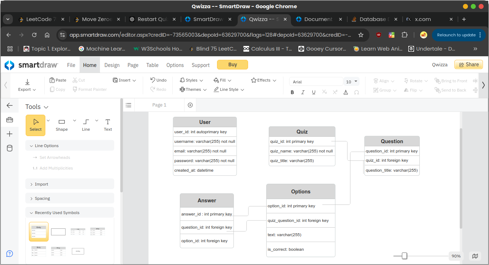

# Qwizza API Documentation

## Features

### User Authentication (JWT)
- Admins and students can log in using a username and password.
- Admins have additional privileges (CRUD operations on quizzes and questions).
- Students can only take quizzes and view their scores.

### MySQL Database
- Tables for users, quizzes, questions, answers, and quiz submissions.
- Relationships between quizzes and questions.
- Track which student submitted answers for which quiz.
- User roles (`student`, `admin`) are stored in the `ROLE` column of the `users` table.

### Quiz Management
- Admin can create, update, and delete quizzes.
- Admin can create, update, and delete questions associated with quizzes.

### Quiz Timer
- The backend includes timer functionality by tracking the time when the quiz starts and ends.
- Once the time is up or the student submits the quiz, their answers are scored.

### Score Calculation
- When a student submits their answers, their score is calculated by comparing their answers with the correct answers stored in the database.

### Database Migrations
- The project uses a MySQL database with tables for users, quizzes, questions, and responses.
- The `AutoMigrate` function ensures the tables are created or updated if needed.

---

## API Endpoints

### Admin

#### POST /admin/login
**Login (returns JWT token).**

**Request Body**:
```json
{
  "email": "jackdoe@gmail.com",
  "password": "password"
}
```

**Successful Response - 200**:
```json 
{
  "message": "Login successful",
  "token": "your-jwt-token-here"
}
```

**Response on Invalid Credentials - 401**:
```json 
{
  "message": "Invalid credentials",
  "error": "Incorrect email or password"
}
```

**Response on Missing Fields - 400**:
```json 
{
  "message": "Missing required fields",
  "error": "Both email and password are required"
}
```

**Response on Server Error - 500**:
```json
{
  "message": "Internal server error",
  "error": "Info about the internal error"
}
```

### Admin: Quiz Management

#### POST /admin/quiz
**Create a new quiz.** (Admin only)

**Request Body**:
```json
{
  "title": "Math Quiz",
  "description": "A challenging quiz on basic math",
  "duration": 30,
  "startTime": "2025-01-17T10:00:00Z"
}
```

**Response - 201**:
```json
{
  "message": "Quiz created successfully",
  "quiz_id": 1
}
```

#### PUT /admin/quiz/{id}
**Update an existing quiz.** (Admin only)

**Request Body**:
```json
{
  "title": "Advanced Math Quiz",
  "description": "An advanced quiz on math concepts",
  "duration": 45,
  "startTime": "2025-01-20T12:00:00Z"
}
```

**Response - 200**:
```json
{
  "message": "Quiz updated successfully"
}
```

#### DELETE /admin/quiz/{id}
**Delete a quiz.** (Admin only)

**Response - 200**:
```json
{
  "message": "Quiz deleted successfully"
}
```

---

## Setup & Installation

### Prerequisites
- Go 1.16 or higher
- MySQL database server

### Installation Steps
1. Clone the repository:
   ```bash
   git clone https://github.com/whotterre/qwizza
   ```
2. Navigate to the project folder:
   ```bash
   cd qwizza
   ```
3. Install Go dependencies:
   ```bash
   go mod tidy
   ```
4. Set up the MySQL database with the provided schema.
   - The schema includes the `users`, `quiz`, `question`, and `response` tables.
   - The `AutoMigrate` function in the project will automatically create these tables if they do not exist.
5. Start the server:
   ```bash
   go run main.go
   ```

---

## License
MIT License - See [LICENSE](LICENSE) for more details.

